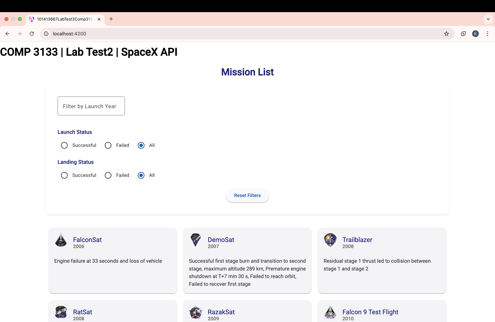
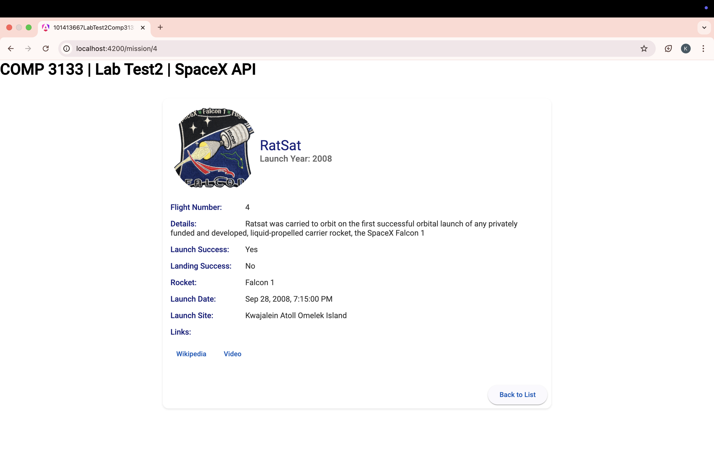

# 101413667-lab-test2-comp3133

## Overview
This project is a lab test submission for COMP 3133, created by Keyur. It is a web application built with Angular that interacts with the [SpaceX API](https://api.spacexdata.com/v3/launches) to display a list of SpaceX missions. Users can filter missions by launch year, launch success, and landing success, and view detailed information about each mission.

### Features
- **Mission List**: Displays a list of SpaceX missions with their name, launch year, details, and mission patch image.
- **Filters**: Allows filtering missions by:
  - Launch year (e.g., 2020)
  - Launch success (successful/failed)
  - Landing success (successful/failed)
- **Mission Details**: Shows detailed information about a selected mission, including flight number, rocket details, launch site, and links to Wikipedia and video.
- **Responsive Design**: Uses Angular Material for a clean, modern UI with card layouts, larger images, and hover effects.
- **Loading Spinner**: Displays a spinner while fetching data from the API.
- **Deployment**: Deployed on Vercel with automatic deployments from GitHub.

## Tech Stack
- **Frontend**: Angular 17+
- **Styling**: Angular Material, custom CSS
- **API**: SpaceX API (`https://api.spacexdata.com/v3/launches`)
- **Deployment**: Vercel
- **Version Control**: Git/GitHub

## Setup Instructions
Follow these steps to run the project locally.

### Prerequisites
- **Node.js**: Version 18.x or higher
- **npm**: Version 9.x or higher
- **Angular CLI**: Install globally with:
  ```bash
  npm install -g @angular/cli
  ```

### Installation
1. **Clone the Repository**:
   ```bash
   git clone https://github.com/<your-username>/101413667-lab-test2-comp3133.git
   cd 101413667-lab-test2-comp3133
   ```

2. **Install Dependencies**:
   ```bash
   npm install
   ```

3. **Run the Application**:
   ```bash
   ng serve
   ```
   - Open your browser and navigate to `http://localhost:4200`.

### Build for Production
To build the project for production:
```bash
ng build
```
- The output will be in the `dist/101413667-lab-test2-comp3133` folder.

## Usage
1. **Mission List**:
   - On the homepage (`/`), you’ll see a list of SpaceX missions.
   - Each mission card displays the mission name, launch year, details, and a mission patch image.
   - Click on a mission card to view its details.

2. **Filters**:
   - Use the filter section to filter missions by:
     - **Launch Year**: Enter a year (e.g., `2020`) to filter missions from that year.
     - **Launch Success**: Select "Successful" or "Failed" to filter by launch outcome.
     - **Landing Success**: Select "Successful" or "Failed" to filter by landing outcome.
   - Click "Reset Filters" to clear all filters and show all missions.

3. **Mission Details**:
   - Navigate to `/mission/<id>` (e.g., `/mission/1`) to view details of a specific mission.
   - Details include flight number, launch success, landing success, rocket name, launch date, launch site, and links to Wikipedia and video.

## Deployment
The project is deployed on Netlify.

- **Live URL**: [https://101413667labtest2comp3133.netlify.app](https://101413667labtest2comp3133.netlify.app)
- **GitHub Repository**: [https://github.com/keyurod/101413667-lab-test2-comp3133](https://github.com/keyurod/101413667-lab-test2-comp3133)


## Submission Details
This project is submitted for COMP 3133 Lab Test 2 on April 2, 2025.

- **Student ID**: 101413667
- **Course**: COMP 3133
- **Assignment**: Lab Test 2
- **Submission**:
  - **Blackboard**: Uploaded `101413667-lab-test2-comp3133.zip` with GitHub and netlify URLs in the comments.
  - **D2L**: Uploaded screenshots (`mission-list.png` and `mission-details.png`).

## Screenshots
### Mission List


### Mission Details



## Acknowledgments
- Thanks to the SpaceX API for providing the data.
